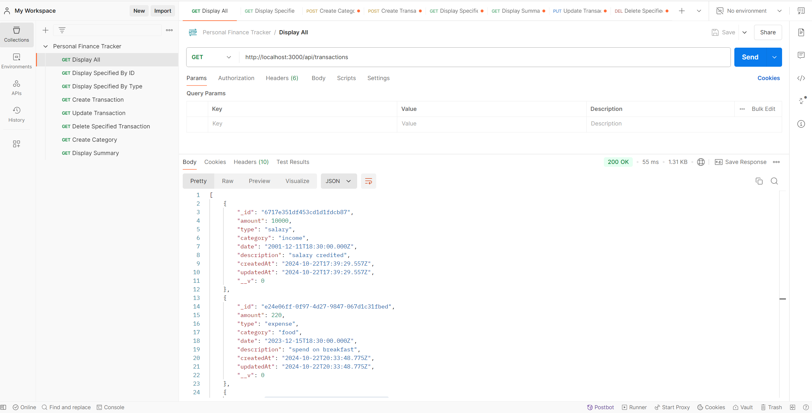
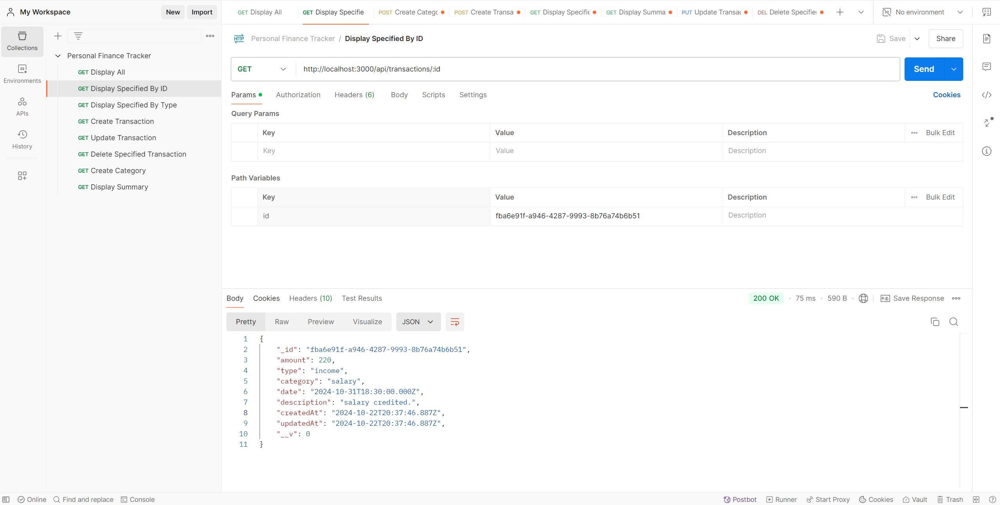
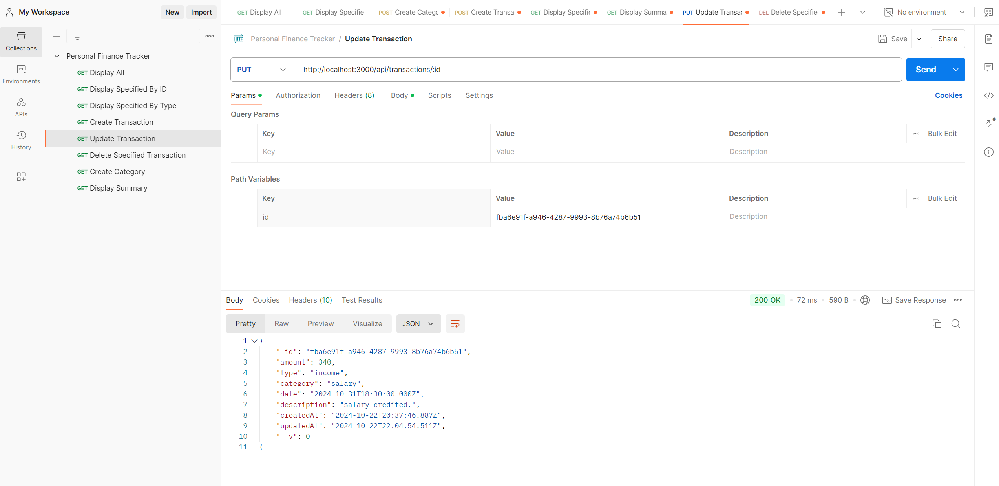
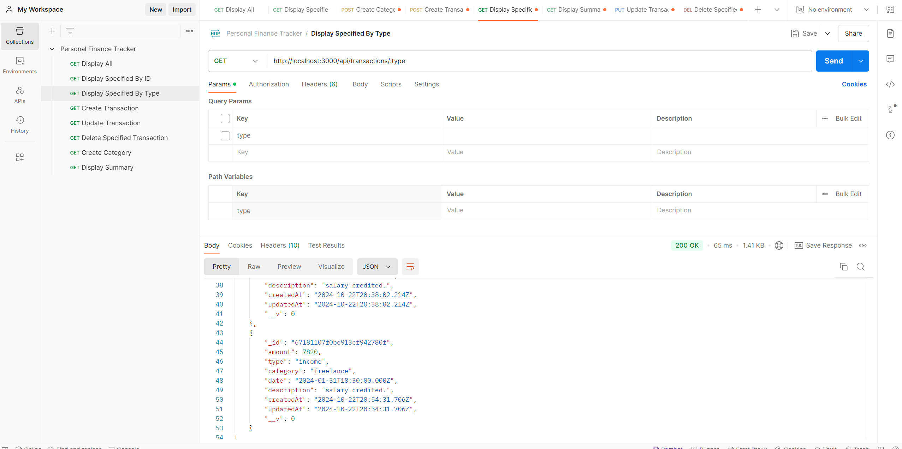
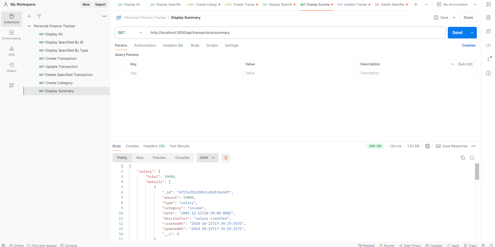

# Personal Expense Tracker

## Overview
This API allows users to manage personal financial records, including income and expenses, by recording transactions, retrieving past records, and generating summaries.

## Features
- Add, update, delete, and retrieve transactions.
- Generate transaction summaries filtered by date range or category.

## Technologies Used
- **Backend Framework**: Node.js with Express.js
- **Database**: MongoDB using Mongoose

## Prerequisites
- Node.js
- MongoDB

## Setup Instructions

### Step 1: Clone the repository
```sh
git clone https://github.com/sai-prasanth-k/finance_tracker.git
cd finance-tracker


```
### Step 2: Install dependencies
```sh
npm install
```

### Step 3: Set up environment variables
Create a .env file in the root directory and add your MongoDB URI:
```sh
MONGODB_URI=mongodb+srv://<username>:<password>@cluster0.mongodb.net/finance-tracker?retryWrites=true&w=majority
```

### Step 4: Run the server
```sh
npm run start
```

## API Reference

### API 1 - Create a Category

#### Path: `/api/categories/`

#### Method: `POST`

#### Description:

Adds a new category.

####  Request Body:

```
{
  "name": "Groceries",
  "type": "expense"
}

```

#### Response

```
{
  "_id": "unique-transaction-id",
  "type": "income",
  "category": "salary",
  "amount": 10000,
  "date": "2023-11-01T00:00:00.000Z",
  "description": "Salary credited."
}

```

### API 2 - Create a Transaction

#### Path: `/api/transactions/`

#### Method: `POST`

#### Description:

Adds a new transaction.


#### Request Body:

```

{
  "type": "expense",
  "category": "Groceries",
  "amount": 100.0,
  "date": "2023-12-01",
  "description": "Grocery shopping"
}

```

#### Response:

```
{
  "_id": "unique-transaction-id",
  "type": "expense",
  "category": "groceries",
  "amount": 100.0,
  "date": "2023-12-01T00:00:00.000Z",
  "description": "Grocery shopping"
}

```


### API 3 - Retrieve All Transactions

#### Path: `/api/transactions/`

#### Method: `GET`

#### Description:

Returns the list of all transactions.

#### Response

```
[
  {
    "_id": "unique-transaction-id",
    "type": "expense",
    "category": "groceries",
    "amount": 100.0,
    "date": "2023-12-01T00:00:00.000Z",
    "description": "Grocery shopping"
  }
]

```
#### Postman API testing to retrieve all transaction.



### API 4 - Retrieve Transaction by ID

#### Path: `/api/transactions/`

#### Method: `GET`

#### Description:

Retrieves all transactions.

#### Response:

```
[
  {
    "_id": "unique-transaction-id",
    "type": "expense",
    "category": "Groceries",
    "amount": 100.0,
    "date": "2023-12-01T00:00:00.000Z",
    "description": "Grocery shopping"
  }
]


```

#### Postman Api Testing Result to Retrieve Transaction by ID :




### API 5 - Update a Transaction

#### Path: `/api/transactions/:id`

#### Method: `GET`

#### Description:

Retrieves all transactions by its ID.

#### Response:

```
{
  "_id": "unique-transaction-id",
  "type": "expense",
  "category": "Groceries",
  "amount": 100.0,
  "date": "2023-12-01T00:00:00.000Z",
  "description": "Grocery shopping"
}

```

#### Postman Api Testing Result for Updating a Transaction:



### API 6 - Retrieve Transaction by Type

#### Path: `/api/transactions/:type`

#### Method: `GET`

#### Description:

Retrieve a transaction by its Type.

#### Request Body:

```
{
  "type": "expense"
}
```

#### Response:

```
{
  "_id": "unique-transaction-id",
  "type": "expense",
  "category": "Groceries",
  "amount": 150.0,
  "date": "2023-12-01T00:00:00.000Z",
  "description": "Weekly groceries",
  "__v": 0
}
```

#### Postman Api Testing Result for Retrieve Transaction by Type:


### API 7 - Delete a Transaction

#### Path: `/api/transactions/:id`

#### Method: `DELETE`

#### Description:

Deletes a transaction by its ID.

#### Response

```
{
  "message": "Transaction deleted"
}
```

#### Postman Api Testing Result to delete Transaction by ID:




### API 8 - Delete all Transaction

#### Path: `/api/transactions`

#### Method: `DELETE`

#### Description:

Deletes all transactions.

#### Response

```
{
  "message": "All transactions deleted"
}
```

### API 9 - Get Summary of Transactions

#### Path: `/api/transactions/summary`

#### Method: `GET`

#### Description:

Retrieves a summary of transactions, optionally filtered by date range or category.

#### Query Parameter:

- startDate (optional): Start date in YYYY-MM-DD format.
- endDate (optional): End date in YYYY-MM-DD format.
- category (optional): Category name to filter by.

#### Response

```
{
  "expense": {
    "total": 300.0,
    "details": [
      {
        "_id": "unique-transaction-id",
        "type": "expense",
        "category": "Groceries",
        "amount": 100.0,
        "date": "2023-12-01T00:00:00.000Z",
        "description": "Grocery shopping"
      }
    ]
  }
}
```

#### Postman Api Testing Result to summary of the Transaction:




### Error Handling

#### Common error responses include:

#### `400 Bad Request`: Invalid input or missing required fields.
#### `404 Not Found`: Resource not found.
#### `500 Internal Server Error`: Server encountered an error.


